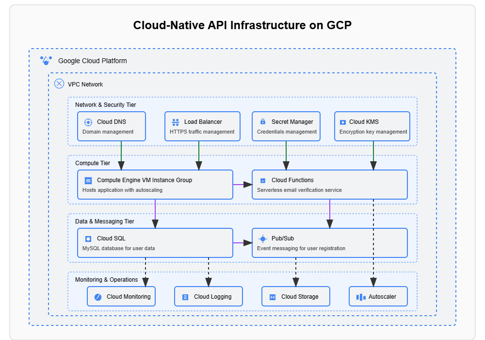

# Cloud-Native API Deployment with CI/CD on Google Cloud Platform (GCP)

## Project Overview

This project implements a cloud-native REST API with a CI/CD pipeline on Google Cloud Platform. The application includes user management functionality and leverages multiple GCP services for a scalable, secure, and robust architecture.

### Key Features:

- **RESTful API Endpoints**:
  - Health Check (`GET /healthz`)
  - User Creation (`POST /v1/user`) with email verification
  - User Details Retrieval (`GET /v1/user/self`)
  - User Details Update (`PUT /v1/user/self`)

- **Cloud-Native Architecture**:
  - Python 3.8 Flask backend
  - MySQL database
  - Infrastructure as Code (IaC) with Terraform
  - Machine Images with Packer
  - Event-driven architecture with Pub/Sub

- **CI/CD Pipeline**:
  - GitHub Actions workflows
  - Automated testing
  - Infrastructure validation
  - Immutable infrastructure deployment

## Architecture

The application utilizes several Google Cloud Platform services:



- **Compute Engine**: Hosts the web application on autoscaled VM instances
- **Cloud SQL**: Managed MySQL database
- **Pub/Sub**: Event handling for user registration
- **Cloud Functions**: Serverless email delivery
- **Secret Manager**: Secure credentials storage
- **VPC Network**: Secure networking
- **Cloud KMS**: Encryption key management
- **Cloud DNS**: Domain name management
- **Cloud Load Balancing**: Traffic management with health checks

The system follows event-driven architecture where user creation triggers a message to Pub/Sub, which then activates a serverless function to send verification emails via Mailgun.

## Project Structure

```
.
├── .github/workflows/           # GitHub Actions CI/CD workflows
├── gcloud_cli/                  # GCP CLI scripts
├── packer/                      # Packer configuration for machine images
│   ├── files/                   # Configuration files for VM instances
│   └── scripts/                 # Setup scripts for VM instances
├── serverless/                  # Cloud Function for email verification
│   ├── config/                  # Configuration for serverless function
│   └── models/                  # Data models for serverless function
├── src/                         # Web application source code
│   ├── config/                  # Application configuration
│   ├── controllers/             # Request handlers
│   ├── middlewares/             # Request/response processing
│   ├── models/                  # Data models
│   ├── services/                # Business logic
│   └── tests/                   # Unit and integration tests
├── static/                      # Static files (swagger.json)
├── terraform/                   # Terraform IaC configuration
│   └── modules/                 # Terraform modules for GCP resources
├── app.py                       # Application entry point
├── create_database.py           # Database initialization script
├── requirements.txt             # Python dependencies
└── various setup scripts        # Helper scripts for setup and deployment
```

## Getting Started

### Prerequisites

- Google Cloud Platform account with billing enabled
- Enabled GCP APIs (see [Enabling APIs](#enable-apis-in-google-cloud-platform))
- Git
- Python 3.8+
- Google Cloud CLI
- Terraform
- Packer

### Installation

#### 1. Install Google Cloud CLI

Follow the instructions at [https://cloud.google.com/sdk/docs/install](https://cloud.google.com/sdk/docs/install) to install the Google Cloud CLI for your platform.

> **Note**: Add the bin directory of gcloud-sdk to PATH variable, else you would have to run the commands with `<path-to-bin of gcloud sdk>/` prefix.

#### 2. Setup Google Cloud CLI

```bash
# Login to your GCP account
gcloud auth login
gcloud auth application-default login

# Set your default project
gcloud config set project <project_id>
```

#### 3. Install Packer

Follow the instructions at [https://developer.hashicorp.com/packer/install](https://developer.hashicorp.com/packer/install) to install Packer for your platform.

#### 4. Install Terraform

Follow the instructions at [https://developer.hashicorp.com/terraform/install](https://developer.hashicorp.com/terraform/install) to install Terraform for your platform.

#### 5. Setup Python Environment

```bash
# Create virtual environment
python -m venv <env_name>

# Activate environment
# For Mac/Linux:
source <env_name>/bin/activate
# For Windows:
<env_name>/Scripts/activate

# Install dependencies
pip install -r requirements.txt
```

#### 6. Configure Environment Variables

Create a `.env` file with the following configuration:

```
SQLALCHEMY_DATABASE_URI_DEV = "mysql://<USERNAME>:<PASSWORD>@<HOST>:<PORT>/<DBNAME>"
SQLALCHEMY_TRACK_MODIFICATIONS = False
DEV_HOST = "0.0.0.0"
DEV_PORT = 8080
PROD_HOST = "0.0.0.0"
PROD_PORT = 8080
PYTHON_ENV = "development"
GOOGLE_PROJECT_ID = "<gcp_project_id>"
GOOGLE_TOPIC_NAME = "<pub/sub_topic_name>"
```

## Enable APIs in Google Cloud Platform

1. Navigate to the Google Cloud dashboard: [https://console.cloud.google.com/welcome/new](https://console.cloud.google.com/welcome/new)
2. From the Navigation Menu > APIs and services > Library
3. Enable the following APIs:
   - Compute Engine API
   - Cloud SQL Admin API
   - Service Networking API
   - Cloud Source Repositories API
   - Identity and Access Management (IAM) API
   - Cloud Monitoring API
   - Cloud Logging API
   - Serverless VPC Access API
   - Eventarc API
   - Cloud Deployment Manager V2 API
   - Cloud DNS API
   - Cloud Functions API
   - Artifact Registry API
   - Cloud Pub/Sub API
   - Cloud Build API
   - Service Usage API
   - Secret Manager API
   - Certificate Manager API
   - Cloud Key Management Service (KMS) API

> **Note**: After enabling the APIs, it may take about 10-15 minutes for them to be activated.

## Create Service Account and Grant Permissions

1. Navigate to the Google Cloud dashboard: [https://console.cloud.google.com/welcome/new](https://console.cloud.google.com/welcome/new)
2. From the Navigation Menu > IAM and admin > Service accounts
3. Create a new or modify an existing service account with the following permissions:
   - Cloud SQL Editor
   - Compute Instance Admin (v1)
   - Compute Network Admin
   - Compute Security Admin
   - IAP-secured Tunnel User
   - OSPolicyAssignment Editor
   - Pub/Sub Publisher
   - Secret Manager Secret Accessor
   - Service Account Token Creator
   - Service Account User
   - Storage Object Viewer

### Add Service Account Key to Environment Variables

1. Navigate to the Google Cloud dashboard
2. From the Navigation Menu > IAM and admin > Service accounts
3. Click on the service account to be used
4. Under "KEYS" tab, click on "ADD KEY" dropdown and select "Create new key"
5. Download the JSON key file and set environment variable:

```bash
export GOOGLE_APPLICATION_CREDENTIALS="<path to key>/<file_name>.json"
```

## Infrastructure Deployment

### Building VM Images with Packer

1. Create a Packer variables file (e.g., `variables.auto.pkrvars.hcl`):

```hcl
project_id          = "<project_id>"
zone                = "<project_zone>"
machine_type        = "<machine_type>"
ssh_username        = "<name_of_the_service_account>"
use_os_login        = false or true
source_image_family = "<os_family>"
webapp_version      = <webapp_version>
mysql_root_password = <mysql_password to be created for 'root' user>
```

2. Validate the Packer configuration:

```bash
packer validate .
```

3. Build the image:

```bash
packer build .
```

### Deploying Infrastructure with Terraform

1. Create a Terraform variables file (e.g., `terraform.tfvars`):

```
# Add variables specific to your deployment
# See variables.tf for required variables
```

2. Initialize Terraform:

```bash
terraform init
```

3. Format and validate Terraform files:

```bash
terraform fmt
terraform validate
```

4. Create a deployment plan:

```bash
terraform plan
```

5. Apply the plan to create infrastructure:

```bash
terraform apply
```

## Running the Application Locally

### Initialize Database

```bash
# Create database if it doesn't exist
python create_database.py

# Create database schema
flask db init
flask db migrate
flask db upgrade
```

### Run Tests

```bash
python -m pytest
```

### Start the Application

```bash
python ./app.py
```

## Serverless Function for Email Verification

The serverless function is triggered by Pub/Sub messages and sends verification emails to newly registered users via Mailgun.

### Configuration

Create a `.env` file in the `serverless` directory with the following configuration:

```
MAILGUN_VERSION = "<mailgun_api_version>"
MAILGUN_API_KEY = "<mailgun_api_key>"
DOMAIN_NAME     = "<domain_name>"
DOMAIN_NAME_URL = "<complete_domain_name (including port and protocol)>"
```

## CI/CD with GitHub Actions

### Available Workflows

- `integration_test.yml`: Runs integration tests
- `packer_build_image.yml`: Builds VM images with Packer
- `packer_validate.yml`: Validates Packer configurations
- `terraform_validate.yml`: Validates Terraform configurations

### Required Secrets

Add the following secrets to your GitHub repository:

For integration tests:
- `DB_PASSWORD`: Database password
- `DB_USER`: Database username
- `ENV_FILE`: Contents of the `.env` file

For Packer workflows:
- `GCP_CREDENTIALS_JSON`: Contents of the service account JSON key file
- `PACKER_CONFIG`: Contents of the Packer variables file

## License

This project is licensed under the terms found in the LICENSE file.
